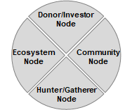
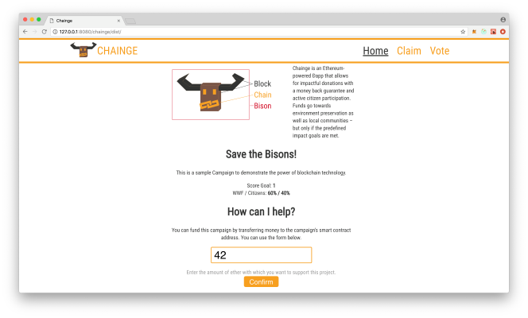
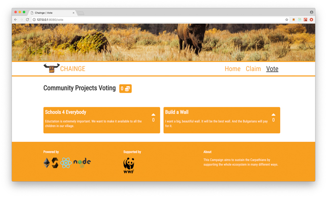
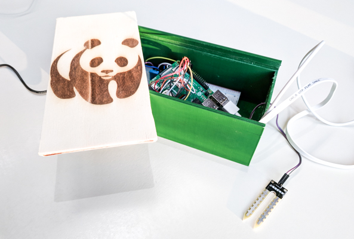

# Chainge - An Incentive System to Save the Planet
### Ethereum-powered Ðapp that allows for impactful donations with a money back guarantee, decentralized storage of sensor data and active citizen participation

*Disclaimer: This is a hackathon project that was built over the course of two days by students of ETH Zurich. It is by no means perfect. Don’t use it in a real setting, but feel free to be inspired for your own projects.*

Preserving nature and limiting human impact on the environment belong to the most important global challenges of today. However, the planet can not be saved in one day: Environmental campaigns oftentimes fail not due to limited funds, but because short-term rewards for locals acting ecologically are limited and because measuring the impact of such campaigns is hard. Using blockchain technology, we propose a system that offers citizens incentives to not only preserve the environment they live in, but to actively participate in the preservation. Donations are processed in a decentralized way and donors therefore have complete transparency of where their money is going. Additionally, they are reimbursed in case their donations do not have the desired impact.

This is a project submission for the 2019 BETH "Blockchain School for Sustainability" hackathon. It was built for the "Wild AI" challenge by WWF and uses the Ethereum network. The current version is a functional (but admittedly hacky) prototype that runs on the Ropsten testnet.

The following students from ETH Zurich contributed to the project: Nico Hauser, David Rode, David Schmid, Ben Spöttling, Patrick Züst.

# Overview

Environmental campaigns are most successful, if they are supported by local citizens. Chainge campaigns thus allocate only a certain part of the campaign's total budget to environmental preservation measures. Remaining funds go towards rewarding citizens for their participation and supporting local communal initiatives, if the previously defined impact goals are met. This is secured by modern blockchain technology and checked by sensors that constantly monitor different environmental factors. Each campaign consists of three stages:

Immediately after the smart contract is submitted to the blockchain, the donation period starts. Donors can read information about the campaign online and donate Ether to support the cause. After a certain period of time, the campaign is initiated. Citizens now have the opportunity to complete actions that are created by the campaign initiator. They then get rewarded with Ether and special voting tokens. Sensors are monitoring changes of environmental factors and save those values in an immutable blockchain. At the end of a campaign, it is automatically checked whether the impact goals were met. If that is not the case, the remaining funds are returned to the donors proportionally to their initial investment. However, if the community was able to achieve the goals of the campaign, the voting phase starts: Active gatherers can allocate their voting tokens towards different community initiatives and the remaining funds are split among those projects according to the token distribution.

# Features

The features of Chainge are presented in regards to the nodes of the WWF diagram shown below. As this project is only a prototype of a much bigger vision, some ideas for further improvements are listed, too. 

 

## Donors

- Information about a campaign and specific impact goals are displayed on the website. Those details are stored in a blockchain and it is hence impossible to change them retrospectively.

- Donors can make an Ether donation to the campaign, if they are convinced of the specific parameters and impact goals. The funds are then stored in a decentralized smart contract and can therefore only be used for their intended purpose. This can easily be verified by donors as well as regulators - there is no need to trust a middleman.

- A previously defined split of the donations is automatically sent to the initiator of the campaign. It is however not possible to claim any other donations.

- In case the campaign goals are not met, the remaining funds are reimbursed automatically to the donors. This is a reassurance for them but also an incentive for the citizens and the project initiator to meet said goals.

### Further development

- Donors could be allowed to explicitly state how much of their money should go towards the environmental campaign and how much towards the community project. 

- With the data gathered during a campaign, it is possible to automatically generate regular updates for donors.
  

## Community 

- If the impact goals are met, active community members can participate in a vote about the allocation of the remaining funds. They can distribute their tokens to different projects according to their preferences. Tokens can not be traded to prevent fraudulent use.

- The smart contract automatically transfers the funds to the community projects proportionally to the allocated voting tokens. Neither the campaign initiator nor the donors can interfere in this process. 

- Blockchain technology is keeping track of every action and awarded token. Fraud and hacks are effectively prevented.

### Further development

- Community projects can currently only be initiated by the contract owner. In a future version, it might be possible for community members to propose new projects, while the campaign is running. To prevent abuse, it would be necessary to verify these projects - either centrally by the campaign initiator or alternatively by the community members and/or the campaign donors.

## Gatherer

- The project initiator is able to define positive actions that the citizens can take to support the campaign. Each action automatically rewards a predefined amount of voting tokens and Ether to the citizen after successful completion.

### Further development

- Data submitted by gatherers is not processed or stored, as we are only working with test data.

- There is currently no verification system in place to check the submitted actions. This check could be sformed either by the campaign initiator or (preferably) by other community members. This would demand a reputation score system: The trustworthiness of citizens decreases, if they consciously make false claims or if they verify claims that turn out to be false.

- Certain actions can be verified automatically by using technologies like image recognition and statistical analysis.

- The reward for certain actions could be set by an auction system, where citizens make bids for actions. This would lead to rewards that are more adequate than those predetermined by campaign initiators.

## Ecosystem

- Sensors are sending data in regular intervals to the blockchain, where they are stored decentralized. The data is immutable and manipulations are therefore not possible. 

### Further development

- Sensor data is currently stored on chain which leads to high transaction costs. It could alternatively be saved on IPFS or in a database that is only partially decentralized.

# Technology

## Hardware

Sensors play a vital role during a campaign. They independently gather data that allows initiators and donors to track the progress of the campaign. This will ultimately determine its success. The accuracy of sensors and the secure storage of data are therefore crucial.

The Chainge prototype currently contains GPS-, temperature- and humidity-sensors for both air and soil. It can easily be equipped with additional sensors and thus allows for a precise monitoring of the local biosystem. 

Cost is a major factor for public foundations and the individual components of the prototype are therefore regular off-the-shelf products. The plastic casing was manufactured by additive manufacturing at a low price. The heart of the prototype is a Raspberry Pi single-board computer; the sensors are connected via cable connections and a breadboard. It is possible for local communities to build the entire device at a cost of less than 70$. If they were manufactured in mass production, the price would of course be considerably lower.

Sensor input is processed by a Python program and then sent to the blockchain using Node.js. The current prototype has to be plugged in to the power system at all times and connects to the internet via WIFI. However, the electricity of future version could be supplied by batteries and data might be transferred over a LoRaWAN network. This would ensure high mobility and self-reliance without compromising connectivity. The device could additionally be equipped with air quality sensors, cameras, microphones and smoke detectors.

The prototype has QR-codes placed at the inside and the outside of its case. When checking sensors for functionality or replacing batteries, locals could potentially scan these codes to prove their action and thus obtain a compensation.

## Software

The smart contract was written in Solidity and runs on the Ethereum network. The responsive web interface is built on React and uses the web3.js API to connect to the smart contract. 

# Setup

- Clone the project with `git clone https://github.com/betherworld/chainge.git`
- Change the working directory `cd chainge`
- Install all dependencies with `yarn install` or `npm install`
- Install and start [Ganache](https://truffleframework.com/ganache)
- Install [truffle](https://github.com/trufflesuite/truffle/) with `yarn global add truffle` or `npm install -g truffle`
- Deploy contract to the blockchain with `truffle migrate`
- Retrieve the contract address from the output of the last command
- Copy the `.env.example` file to `.env` and set `CAMPAIGN_ADDRESS` to the retrieved contract address
- Run the development server with `yarn dev`

In order to interact with the website, you need the [MetaMask](https://metamask.io) extension in a chromium browser.
